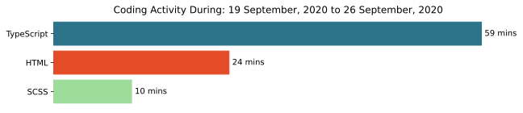

### Hi 👋,
 <style>body {
    padding: 0;
    margin: 0;
    font-size: 20px;
    font-weight: bold;
    color: #1612d6;
    text-align: center;
}

img {
    max-width: 100%;
    object-fit: cover;
}

img:first-of-type {
    opacity: 0.3;
    z-index: 1;
}

img:last-of-type {
    z-index: 3;
    position: absolute;
    top: 20%;
    left: 20%;
    background: transparent;
}</style>
 <h1>I am Anita , Developer web front-end.</h1>
    
    

<!--START_SECTION:waka-->
```text

```
<!--END_SECTION:waka-->

- 🔭 I’m currently working on javascript challenges, front-end challenges
- 🌱 I’m currently learning React

<!-- - 👯 I’m looking to collaborate on ...
- 🤔 I’m looking for help with API, JSON
- 💬 Ask me about CSS
- 📫 How to reach me: ...
- 😄 Pronouns: ...
- ⚡ Fun fact: ...-->
